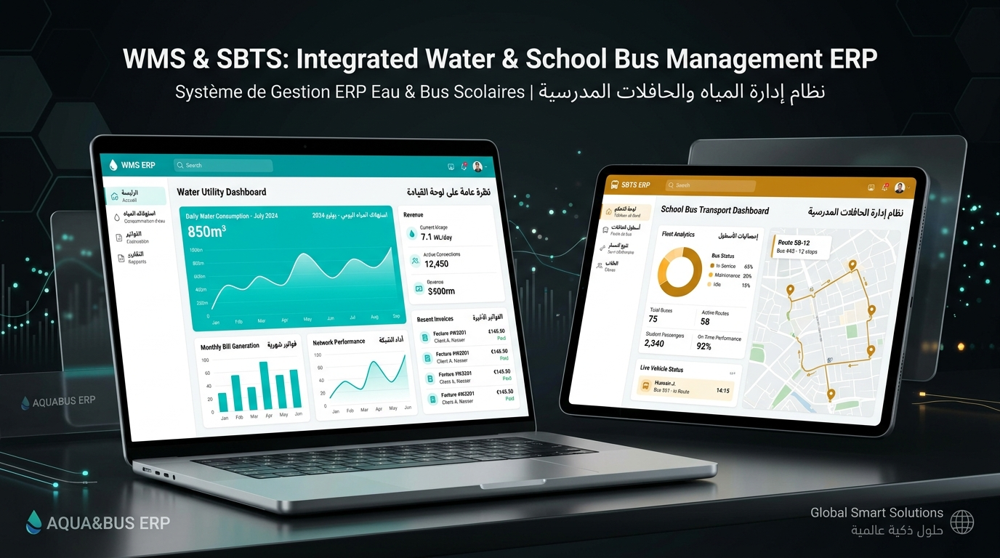

<div align="center">



# 💧 Water & School Transport Association Management ERP
### نظام ERP المتكامل لإدارة جمعيات توزيع الماء الصالح للشرب والنقل المدرسي

<p align="center">
  <a href="#-معاينة-حية-مباشرة--live-interactive-demo"></a>
  <a href="#-licence"></a>
  <a href="#-technical-stack"></a>
  <a href="#-technical-stack"></a>
  <a href="#-security--rbac"></a>
</p>

<p align="center">
  <strong>حل مؤسساتي متكامل وذكي مصمم لرقمنة تسيير جمعيات الماء الصالح للشرب وأساطيل النقل المدرسي في العالم القروي وشبه الحضري.</strong>
  <br />
  A production-ready Enterprise Resource Planning (ERP) platform built for rural utility associations and municipal transport networks.
</p>

---

### 🌐 [🚀 معاينة حية مباشرة | Live Interactive Demo](https://biga5645.github.io/Water-School-Transport-ERP/)
*(يمكنك اختبار وتجربة النظام بالكامل مباشرة من المتصفح دون الحاجة إلى تثبيت أي برامج — يدعم التجربة السريعة لجميع الأدوار بنقرة واحدة)*

---

</div>

## 📑 Table of Contents / فهرس المحتويات
1. [🌟 Project Overview & Value Proposition](#-project-overview--value-proposition)
2. [⚡ Key Functional Modules](#-key-functional-modules)
3. [🔐 Security, RBAC & Architecture](#-security-rbac--architecture)
4. [🛠️ Technical Stack & Performance](#️-technical-stack--performance)
5. [🚀 Quickstart & Installation](#-quickstart--installation)
6. [🇲🇦 العرض الشامل للمشروع باللغة العربية](#-العرض-الشامل-للمشروع-باللغة-العربية)
7. [💼 Hire Me / متاح للمشاريع وتطوير الأنظمة](#-hire-me--متاح-للمشاريع-وتطوير-الأنظمة)
8. [📄 License](#-license)

---

## 🌟 Project Overview & Value Proposition

Rural water distribution associations and school transport organizations in North Africa manage critical daily infrastructure for thousands of citizens. However, most still rely on error-prone paper ledgers, fragmented spreadsheets, and informal cash collections, resulting in:
- High unpaid debts and delayed water bill collection.
- Meter reading errors and inaccurate tariff calculations.
- Lack of visibility over school bus maintenance, routes, and monthly subscriptions.
- Absence of real-time financial transparency and accountability for general assemblies.

**Association ERP** solves these operational challenges through a centralized, high-performance web platform that bridges community utility operations with enterprise-level financial governance.

---

## ⚡ Key Functional Modules

```
┌─────────────────────────────────────────────────────────────────────────────┐
│                       ASSOCIATION ERP ECOSYSTEM                             │
├──────────────────────────────┬──────────────────────────────┬───────────────┤
│    💧 WATER UTILITY MGMT     │    🚌 SCHOOL TRANSPORT       │  💼 FINANCE   │
├──────────────────────────────┼──────────────────────────────┼───────────────┤
│ • Subscribers & Sectors (GPS)│ • Fleet Tracking & Buses     │ • Double-Entry│
│ • Meter Inventory & Barcodes │ • Dynamic Bus Routes         │ • Revenue Log │
│ • Reading Cycles & Anomaly   │ • Student Registry           │ • Expense Log │
│ • Tiered Tariff Engine       │ • Monthly Pass Subscriptions │ • Cash Flow   │
│ • Automatic Billing & QR     │ • Driver & Assistant Staff   │ • Annual P&L  │
│ • Receipts & Debt Recovery   │ • Attendance Monitoring      │ • CSV & Print │
└──────────────────────────────┴──────────────────────────────┴───────────────┘
```

### 1. 💧 Water Distribution & Metered Billing
* **Subscribers & Sectors**: Full database of village subscribers, CIN national IDs, phone numbers, and geolocation coordinates.
* **Smart Meter Management**: Tracking meter serials, diameters (15mm/20mm), brands (Zenner, Aquameter, Itron), and maintenance history.
* **Reading Cycles & Verification**: Structured reading periods, anomaly detection for consumption spikes, photo evidence uploads, and verification workflows.
* **Tiered Tariff Calculator**: Progressive cubic-meter pricing brackets, fixed maintenance fees, VAT calculations, and penalty rules.
* **Billing & Thermal Printing**: Automated invoice generation with QR codes, print-ready receipts, cash/check collection tracking, and partial payment handling.
* **Debt Management & Disconnection**: Automated tracking of overdue accounts (>30, >60 days), SMS/WhatsApp reminders, and formal cutoff/reconnection orders.

### 2. 🚌 School Bus Fleet & Student Transport
* **Fleet Management**: Bus inventory, capacities, road permits, and maintenance logs.
* **Route Planning**: Defining departure points, villages, school destinations, and timetables.
* **Student Pass Registry**: Guardian contacts, schools, grade levels, and subscription payment statuses.
* **Driver & Assistant Management**: Direct assignment of drivers and route assistants.

### 3. 💼 Financial Accounting & Human Resources
* **Revenues & Expenses**: Categorized expense tracking (fuel, pump electricity, equipment repairs, salaries) and diversified income (water bills, bus passes, public grants).
* **Automated Monthly & Annual Reports**: Real-time balance calculations, collection rate KPIs, and one-click financial audit sheets.
* **Human Resources**: Staff records, contract information, monthly salary disbursements, and daily attendance logs.

---

## 🔐 Security, RBAC & Architecture

The system incorporates robust defense-in-depth principles:
* **HMAC-SHA256 Signed Tokens**: Stateless session authentication preventing header spoofing.
* **scrypt Password Hashing**: Cryptographic key-derivation for password storage with automatic transparent migration.
* **Granular RBAC (Role-Based Access Control)**: Enforced both on server endpoints and dynamic UI elements.
* **XSS & Injection Protection**: Unified output escaping barrier (`deepEscape`), parameterized MySQL operations, and CSV-formula injection guards.

### Role & Permission Matrix

| Role | Water & Meters | Billing & Cash | School Transport | Accounting & HR | System Settings |
| :--- | :---: | :---: | :---: | :---: | :---: |
| 👑 **Super Admin** | Full | Full | Full | Full | Full |
| 🏛️ **President** | View | View | View | View | Association |
| 💰 **Treasurer** | View | **Collect & Edit** | View | **Full Accounting** | Reports |
| 📊 **Meter Reader** | **Read & Submit** | - | - | - | - |
| 🚌 **Transport Manager** | - | - | **Full Fleet** | View | - |
| 💼 **Accountant** | - | Invoices | - | **Full Ledger** | Audit Logs |
| 📝 **Secretary** | Customers | View | - | - | Legal Documents |
| 🧾 **Billing Agent** | Customers | **Issue Bills** | - | - | - |
| 🔧 **Maintenance** | **Repairs** | - | - | - | - |

---

## 🛠️ Technical Stack & Performance

* **Zero-Dependency Native Backend**: Node.js standard libraries (`http`, `crypto`, `fs`, `path`) combined with `mysql2/promise`. Blazing fast startup under 80ms with minimal memory footprint (<35MB RAM).
* **Single Database Abstraction with Dual Persistence**:
  - Production mode: MySQL / MariaDB relational persistence.
  - Portable demo mode: Local storage / in-memory fallback for instant client showcase.
* **Frontend**: Pure Vanilla HTML5, CSS3, and JavaScript (ES6+). No heavy client frameworks (React/Vue/Angular), resulting in zero build step, lightning-fast rendering, and 100/100 Lighthouse performance.
* **Design & Typography**: Modern bilingual RTL design using Google Cairo font, glassmorphic accents, responsive grid layouts, and custom print stylesheets.

---

## 🚀 Quickstart & Installation

### Option 1: Live Web Demo (Zero Installation)
Visit the interactive preview hosted on GitHub Pages:
👉 **[Open Live Demo](https://biga5645.github.io/Water-School-Transport-ERP/)**
*Use the 1-click login buttons on the login card to explore as Admin, Treasurer, or Transport Manager.*

---

### Option 2: Local Setup with XAMPP & MySQL

1. **Clone the repository**:
   ```bash
   git clone https://github.com/biga5645/Water-School-Transport-ERP.git
   cd Water-School-Transport-ERP
   ```

2. **Install dependencies**:
   ```bash
   npm install
   ```

3. **Configure Database**:
   - Start **MySQL** from the XAMPP Control Panel.
   - Open `http://localhost/phpmyadmin` and create a database named `association`.
   - Copy `.env.example` to `.env` and verify database credentials:
     ```env
     PORT=5173
     DB_HOST=localhost
     DB_PORT=3306
     DB_USER=root
     DB_PASS=
     DB_NAME=association
     ```

4. **Launch the application**:
   - Double click `start.cmd` (on Windows), or run:
     ```bash
     npm run dev
     ```
   - Open your browser at:
     ```
     http://127.0.0.1:5173
     ```

5. **Default Test Credentials**:
   | Account | Email | Password |
   | :--- | :--- | :--- |
   | **Super Admin** | `admin@example.com` | `admin123` |
   | **Treasurer** | `treasurer@example.com` | `treas123` |
   | **Meter Reader** | `reader@example.com` | `reader123` |
   | **Transport Manager** | `transport@example.com` | `trans123` |

---

<div dir="rtl" align="right">

## 🇲🇦 العرض الشامل للمشروع باللغة العربية

### ما هو نظام Association ERP؟
هو نظام إدارة موارد متكامل (ERP) مصمم خصيصاً لتلبية الاحتياجات التشغيلية والقانونية والمحاسبية لـ **جمعيات تدبير وتوزيع الماء الصالح للشرب** و**جمعيات النقل المدرسي** بالمملكة المغربية والعالم العربي.

### أبرز الميزات الميدانية:
1. **تسيير قطاع الماء والعدادات**:
   - رقمنة بيانات المشتركين بدقة (رقم الاشتراك، رقم البطاقة الوطنية CIN، إحداثيات GPS، الدوار).
   - جولات قراءة العدادات مع كشف الاستهلاك غير الطبيعي والتسربات.
   - حساب آلي للفواتير حسب نظام الأشطر المعتمد والرسوم القارة والضريبة.
   - استخراج وتوصيل وصولات الأداء القابلة للطباعة الحرارية (`80mm` و `A4`).
   - تتبع المتأخرات والإنذارات ومساطر قطع وإرجاع التزويد بالماء.

2. **تدبير حافلات النقل المدرسي**:
   - إدارة أسطول الحافلات، الوثائق التقنية، والصيانة الدورية.
   - جدولة المسارات اليومية والمحطات وتوزيع التلاميذ على الحافلات.
   - تتبع استخلاص اشتراكات النقل المدرسي الشهرية للأسر.

3. **المحاسبة والمالية الشفافة**:
   - ضبط المداخيل (فواتير الماء، اشتراكات النقل، منح الجماعة الترابية).
   - توثيق المصاريف (الوقود، فواتير كهرباء المضخات، قطع الغيار، أجور المستخدمين).
   - توليد القوائم المالية والتقارير التركيبية لتقديمها في الجموع العامة السنوية للمنخرطين والسلطات المحلية.

4. **الأمان وصلاحيات الاستخدام (RBAC)**:
   - نظام صلاحيات صارم يضمن لكل متدخل (الرئيس، أمين المال، قارئ العدادات، المحاسب، السائق) الوصول فقط للمهام المخولة له قانونياً.

</div>

---

## 💼 Hire Me / متاح للمشاريع وتطوير الأنظمة

هل تبحث عن مطور ويب متمرس لبناء **نظام إدارة مخصص (Custom ERP/CRM)**، **لوحة تحكم تفاعلية (Dashboard)**، أو **تطبيق ويب أو جوال** عالي الكفاءة يلبي متطلبات مشروعك أو جمعيتك أو شركتك؟

أقدم خدمات تطوير برمجيات احترافية تشمل:
- 💻 **تطوير أنظمة الويب المتكاملة (Full-Stack Web Systems)**: لوحات تحكم سريعة، إدارة المشتركين والفوترة، أتمتة العمليات الإدارية.
- 📱 **تطبيقات الهاتف الذكي (Mobile Apps)**: تطبيقات أندرويد لفرق العمل الميدانية (قراءة العدادات، التتبع الميداني).
- ☁️ **قواعد البيانات والسيرفرات**: Node.js, PHP/Laravel, MySQL, PostgreSQL, Firebase.
- 🎨 **تصميم واجهات احترافية ومريحة (UI/UX)**: واجهات متجاوبة كلياً مع الحواسيب والهواتف بتصميم عربي حديث وأنيق.

### 📬 للتواصل ومناقشة المشاريع:
- **GitHub**: [@biga5645](https://github.com/biga5645)
- **Email**: `biga.dev.pro@gmail.com` *(أو عبر رسائل GitHub)*
- **WhatsApp**: متوفر عند الطلب لمناقشة تفاصيل المشاريع وتحديد المتطلبات.

---

## 📄 License

This project is open-source and licensed under the [MIT License](LICENSE) — free for community associations, personal use, and commercial adaptation.
